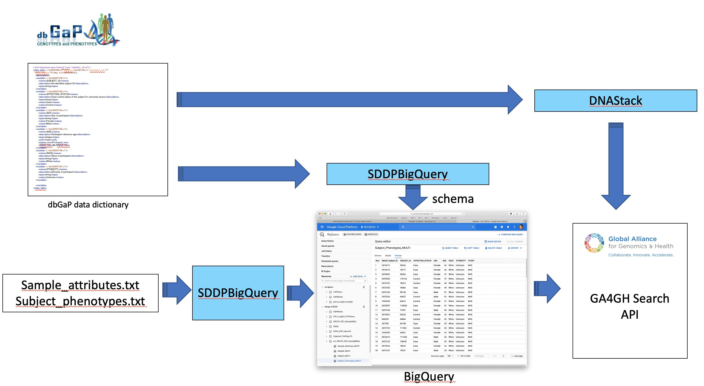

# NIH STRIDES-Codes/subject-sample-search

Welscome to NIH STRIDES-Codes/subject-sample-search.

This codeathon project will explore existing technologies to search subjects and sample data based clinical, phenotypic and other attributes of subjects and sampes. We hope to explore the GA4GH Discovery Search API, BigQuery and FHIR.

The fasp_in branch contains the working code for the codeathon. This was created from a branch in [fasp-scripts](https://github.com/ga4gh/fasp-scripts/tree/master/fasp). That project provides some context for how a Search API might be used with file access and workflow executiion services to compute on biomedical data.

## GA4GH Search

[GA4GH Search](https://github.com/ga4gh-discovery/ga4gh-search) is a new API specification recently been submitted for approval. A reference implementation is available from DNAStack. Search provides the capability to make available data from multiple data technologies such as json, FHIR, Phenopackets and sql databases. 

Options for the codeathon might include

- Exploring and querying the existing data sources
- Adding data sources e.g. as BigQuery Tables
- Installing and running a GA4GH Server

## BigQuery

BiqQuery tables are made available by [SRA](https://www.ncbi.nlm.nih.gov/sra/docs/sra-bigquery-examples/) and by the [Institute for Systems Biology Cancer Genomics Cloud](https://isb-cancer-genomics-cloud.readthedocs.io/en/latest/sections/BigQuery.html).

These allow search of subject and sample data from projects with corresponding genomic data. Searches may be conducted via the Google Cloud Platform console, the BigQuery API, or be set up to be queried by the GA4GH Search reference server. 

## FHIR

The Kids First FHIR Server provides a [data dashboard](https://ncpi-api-fhir-service-dev.kidsfirstdrc.org/dashboard/) and [API endpoint](https://ncpi-api-fhir-service-dev.kidsfirstdrc.org/) to query data from the Kids First initiative. Queries allow links to GA4GH DRS ids to locate genomic data files.

Some search queries that may be useful here: https://docs.google.com/presentation/d/1Vdd1uVitm4H0yx3OkCODJir8dIltki2IGJtZpxddtxw/edit#slide=id.g88f2892937_5_26. 

The full FHIR search spec is here: https://www.hl7.org/fhir/search.html.

## dbGaP

As a database with a rich source of diverse datasets dbGaP is a good test for the use cases GA4GH Search and FHIR are trying to address. To work with it effectively a data scientist needs to be able to discover the fields, codes and structure of data set. The following diagram shows how scrambled representations of dbGaP data have been made available through GA4GH Search making use of the machine readable descriptions (schema) of the data provided by the submitters.

